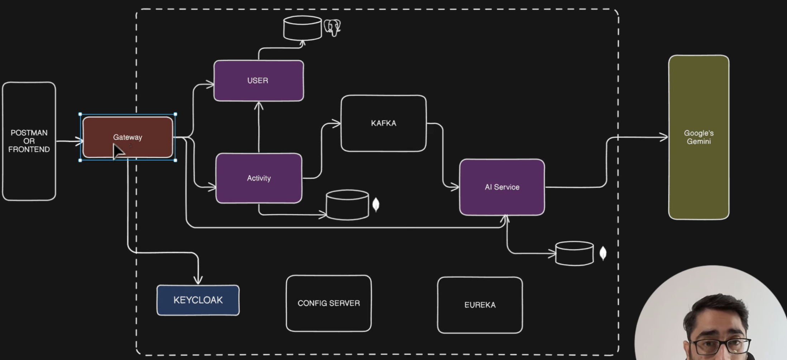

# 🏋️‍♂️ Fit-AI  
> Your Personal AI-Powered Fitness & Health Companion 💪  

  
  
  
  
  




---

## 📌 Overview  
**Fit-AI** is an intelligent fitness and health tracking application that combines **AI-powered recommendations** with **real-time progress monitoring**.  
Whether you want to **track workouts**, **monitor diet**, or get **personalized insights**, Fit-AI is your all-in-one fitness companion.  

✨ **Key Features**:  
- 🔐 Secure **User Registration & Authentication**  
- 📊 **AI-based Workout Recommendations**  
- 🥗 **Diet & Nutrition Suggestions**  
- 🏃 **Progress Tracking & Analytics Dashboard**  
- ⚡ Built with **Spring Boot (Backend)** + **React (Frontend)** + **PostgreSQL (Database)**  

---

## 🚀 Tech Stack  
| Layer | Technology |
|-------|-------------|
| **Backend** | Spring Boot, Java 21, JPA, Hibernate |
| **Frontend** | React, TailwindCSS, Axios |
| **Database** | PostgreSQL + HikariCP |
| **Tools** | Docker, Postman, Maven |
| **Testing** | JUnit 5, Mockito |

---

## 📂 Project Structure  
fit-ai/
│── backend/ (Spring Boot Services)
│   ├── controller/
│   ├── service/
│   ├── repository/
│   ├── entity/
│   ├── exception/
│   └── dto/
│
│── frontend/ (React App)
│   ├── src/
│   │   ├── components/
│   │   ├── pages/
│   │   ├── hooks/
│   │   └── utils/
│
│── docs/ (Documentation + Diagrams)
│── README.md

---


## ⚙️ Installation & Setup  

### 🔹 Backend (Spring Boot)  
```bash
cd backend
mvn spring-boot:run


Step-by-Step Guide: API → Kafka → DB using Docker
Step 1: Docker Setup
Docker install karo (Mac me Homebrew ya official website se).

bash
Copy code
brew install --cask docker
Docker start karo. GUI me whale icon se ya CLI me docker info check karo.

Step 2: Zookeeper Start
Kafka ko run karne ke liye Zookeeper chahiye. Docker me image pull karo aur container start karo:

bash
Copy code
docker pull wurstmeister/zookeeper
docker run -d --name zookeeper -p 2181:2181 wurstmeister/zookeeper
2181 → default port for Zookeeper

-d → detached mode

✅ Zookeeper start hone ke baad, Kafka ko iske upar start karenge.

Step 3: Kafka Start
Kafka Docker image run karo aur Zookeeper connect karo:

bash
Copy code
docker pull wurstmeister/kafka
docker run -d --name kafka -p 9092:9092 \
  -e KAFKA_ZOOKEEPER_CONNECT=host.docker.internal:2181 \
  -e KAFKA_ADVERTISED_LISTENERS=PLAINTEXT://localhost:9092 \
  -e KAFKA_OFFSETS_TOPIC_REPLICATION_FACTOR=1 \
  wurstmeister/kafka
KAFKA_ZOOKEEPER_CONNECT → Zookeeper ka address

KAFKA_ADVERTISED_LISTENERS → Kafka port for clients

KAFKA_OFFSETS_TOPIC_REPLICATION_FACTOR=1 → local testing

✅ Ab Kafka ready hai.

Step 4: Kafka Partition & Topic Creation
Kafka me topic create karna hai jahan aapka data jaayega:

bash
Copy code
docker exec -it kafka kafka-topics.sh --create \
  --topic order-topic \
  --bootstrap-server localhost:9092 \
  --partitions 1 \
  --replication-factor 1
order-topic → jaha API data publish hoga

partitions=1 → simple setup, scalable later

✅ Topic ready hai.

Step 5: API Service (Spring Boot / Node / Python)
Spring Boot app banao jo REST API expose kare:

Endpoint: /place-order

Input: JSON data (order details)

API me Kafka Producer configure karo:

Spring Boot me spring-kafka dependency add karo

Kafka Template use karke data order-topic me bhejo

Example (Spring Boot Kafka Producer):

java
Copy code
@Autowired
private KafkaTemplate<String, String> kafkaTemplate;

public void sendOrder(String orderJson) {
    kafkaTemplate.send("order-topic", orderJson);
}
Step 6: Dockerize Your API
Dockerfile create karo:

dockerfile
Copy code
FROM openjdk:17
COPY target/order-api.jar order-api.jar
ENTRYPOINT ["java","-jar","order-api.jar"]
Docker build & run:

bash
Copy code
docker build -t order-api .
docker run -d --name order-api -p 8080:8080 order-api
✅ API container ready hai.

Step 7: Kafka Consumer → DB
Another service banao ya same API me Kafka Consumer add karo:

java
Copy code
@KafkaListener(topics = "order-topic", groupId = "order-group")
public void consumeOrder(String orderJson) {
    // Parse JSON and save to DB
}
DB container run karo (MySQL example):

bash
Copy code
docker run --name mysql-db -e MYSQL_ROOT_PASSWORD=root -e MYSQL_DATABASE=orders -p 3306:3306 -d mysql:8
Kafka consumer connect karke order-topic se data read karke DB me save karo.

Step 8: Test Flow
Postman / CURL se API hit karo:

bash
Copy code
POST http://localhost:8080/place-order
Body: { "orderId": 101, "item": "Laptop", "qty": 1 }
Kafka producer message bhejega → topic me jayega

Kafka consumer message read karega → DB me save ho jayega

✅ End-to-End flow ready: API → Kafka → DB


🛠️ 5. DOCKER COMMANDS — FULL REFERENCE
--------------------------------------

📦 Start Kafka + Zookeeper (in background):
  docker-compose up -d
  → Creates and starts containers defined in docker-compose.yml

🧹 Stop and remove all containers (clean shutdown):
  docker-compose down
  → Stops containers and removes them from memory

🛑 Stop only running containers (keep them created):
  docker stop zookeeper kafka
  → Stops the containers but does not delete them

🟢 Start already created containers:
  docker start zookeeper kafka
  → Starts containers that were previously stopped

🔍 Check running containers:
  docker ps
  → Shows only currently running containers

🔎 Check all containers (running + stopped):
  docker ps -a
  → Useful for finding old or exited containers

🧨 Remove conflicting container (if name already in use):
  docker rm -f zookeeper
  docker rm -f kafka
  → Forcefully deletes container by name

📥 Pull Kafka and Zookeeper images manually (optional):
  docker pull confluentinc/cp-zookeeper:latest
  docker pull confluentinc/cp-kafka:latest
  → Downloads images from Docker Hub

🧱 Build custom image from Dockerfile:
  docker build -t my-kafka-app .
  → Builds image from current directory using Dockerfile

🚀 Run custom container from image:
  docker run -d --name my-kafka-container -p 8080:8080 my-kafka-app
  → Starts container from your custom image

🧹 Clean up stopped containers:
  docker container prune
  → Removes all stopped containers

🧹 Clean up unused images:
  docker image prune
  → Removes dangling images

🧹 Clean everything (containers + images + volumes):
  docker system prune -a
  → Full cleanup (use with caution)

📂 Open docker-compose.yml for editing:
  nano docker-compose.yml
  → Edit your Kafka + Zookeeper setup

🧠 Tip: Always check for duplicate keys in YAML
  → Only one `version:` and one `services:` block allowed


==============================
🛠️ Kafka + Docker Setup Guide (Full Reference)
==============================

📁 1. Navigate to Kafka Docker Directory
----------------------------------------
Go to your Kafka setup folder:
  cd ~/kafka-docker

If folder doesn't exist, clone it:
  git clone https://github.com/wurstmeister/kafka-docker.git
  cd kafka-docker

📝 2. Open docker-compose.yml for Editing
----------------------------------------
Open file in terminal:
  nano docker-compose.yml

Make sure it has only ONE `version:` and ONE `services:` block.

✅ Example Structure:
---------------------
version: '3.8'

services:
  zookeeper:
    image: confluentinc/cp-zookeeper:latest
    ports:
      - "2181:2181"
    environment:
      ZOOKEEPER_CLIENT_PORT: 2181
      ZOOKEEPER_TICK_TIME: 2000

  kafka:
    image: confluentinc/cp-kafka:latest
    ports:
      - "9092:9092"
    environment:
      KAFKA_BROKER_ID: 1
      KAFKA_ZOOKEEPER_CONNECT: zookeeper:2181
      KAFKA_ADVERTISED_LISTENERS: PLAINTEXT://localhost:9092
      KAFKA_OFFSETS_TOPIC_REPLICATION_FACTOR: 1

💡 3. Pull Docker Images (Only Once)
----------------------------------------
Docker will auto-pull images when you run `docker-compose up` for the first time.

To manually pull:
  docker pull confluentinc/cp-zookeeper:latest
  docker pull confluentinc/cp-kafka:latest

📦 4. Create and Start Containers
----------------------------------------
Start containers in background:
  docker-compose up -d

🛑 5. Stop and Remove Containers
----------------------------------------
Stop and delete containers:
  docker-compose down

🟡 6. Stop Containers Only (Keep Created)
----------------------------------------
Stop running containers:
  docker stop zookeeper kafka

🟢 7. Start Existing Containers
----------------------------------------
Start already created containers:
  docker start zookeeper kafka

🔍 8. Check Running Containers
----------------------------------------
List running containers:
  docker ps

List all containers (including stopped):
  docker ps -a

🧹 9. Remove Conflicting Containers
----------------------------------------
If error: "Container name already in use"

Run:
  docker rm -f zookeeper
  docker rm -f kafka

🧱 10. Build Custom Docker Image (Optional)
----------------------------------------
If you want to build your own image:

Create Dockerfile:
  nano Dockerfile

Example:
  FROM openjdk:21
  COPY . /app
  WORKDIR /app
  RUN ./mvnw clean install
  CMD ["java", "-jar", "target/your-app.jar"]

Build image:
  docker build -t my-kafka-app .

Run container:
  docker run -d --name my-kafka-container -p 8080:8080 my-kafka-app

🧠 11. Common Docker Cleanup Commands
----------------------------------------
Remove all stopped containers:
  docker container prune

Remove unused images:
  docker image prune

Remove everything (containers + images + volumes):
  docker system prune -a

==============================
✅ End of Guide
==============================
// Step 1: Click the initial "View" button to open the modal
const viewButton = document.querySelector('#interested-btn');
if (viewButton) {
  viewButton.click();
  console.log('%c🚀 Opened modal by clicking View button', 'color: green; font-weight: bold;');
} else {
  console.log('%c⚠️ View button not found — maybe modal is already open.', 'color: orange; font-weight: bold;');
}

let applyCount = 0;
let intervalId = null;

// Step 2: Run the apply logic every 3 seconds
intervalId = setInterval(() => {
  const bulkApplyButton = document.querySelector('button.btn-success[ng-click="applyBulk()"]');
  const normalApplyButton = document.querySelector('.apply[ng-click*="submitChoice"] .new-btn');

  if (bulkApplyButton && !bulkApplyButton.disabled) {
    bulkApplyButton.click();
    applyCount++;
    console.log(`%c✅ [${applyCount}] Bulk Apply clicked at ${new Date().toLocaleTimeString()}`, 'color: blue');
    return;
  }

  if (normalApplyButton) {
    normalApplyButton.click();
    applyCount++;
    console.log(`%c✅ [${applyCount}] Normal Apply clicked at ${new Date().toLocaleTimeString()}`, 'color: teal');
    return;
  }

  // If no apply buttons found — STOP
  console.log('%c🎉 All jobs applied successfully!', 'color: limegreen; font-size: 16px; font-weight: bold;');
  console.log(`%c🧾 Total Jobs Applied: ${applyCount}`, 'color: #2196F3; font-weight: bold;');
  clearInterval(intervalId);
}, 3000);


send
Send message
19:06

